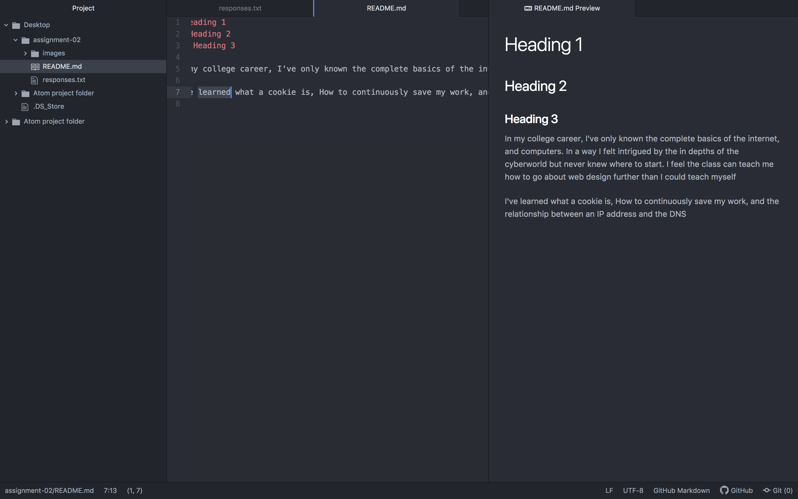

# Heading 1
## Heading 2
### Heading 3

In my college career, I've only known the complete basics of the internet, and computers. In a way I felt intrigued by the in depths of the cyberworld but never knew where to start. I feel the class can teach me how to go about web design further than I could teach myself

I've learned what a cookie is, How to continuously save my work, and the relationship between an IP address and the DNS

[Running wear House](https://www.runningwarehouse.com/)

[My response](./responses.txt)

